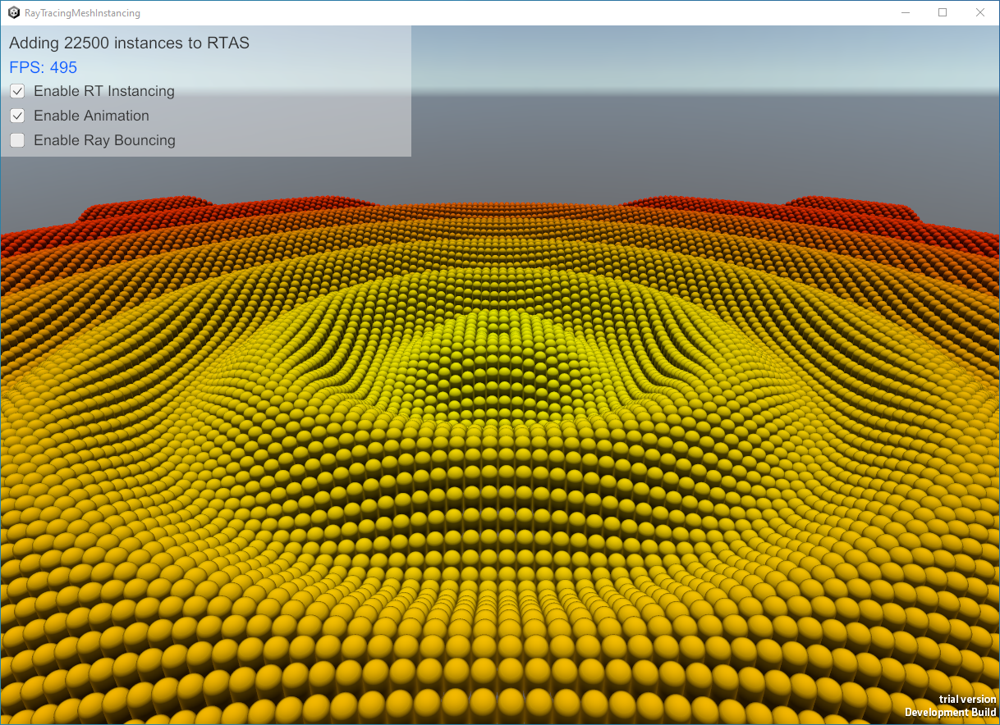
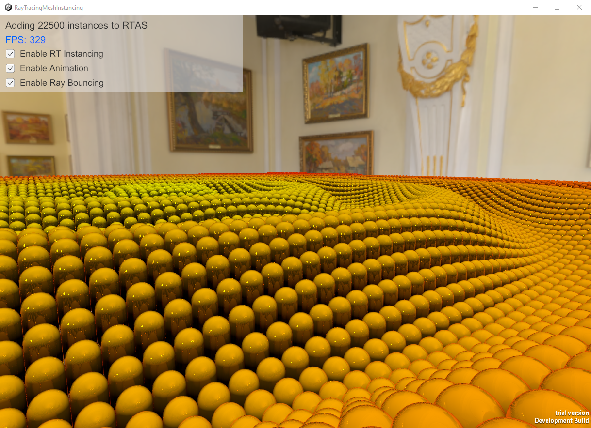

# RayTracingMeshInstancingSimple
Unity sample project using instancing and per-instance shader properties in Ray Tracing.

## Description
The project uses [RayTracingAccelerationStructure.AddInstances](https://docs.unity3d.com/2023.1/Documentation/ScriptReference/Rendering.RayTracingAccelerationStructure.AddInstances.html) function to add many ray tracing instances of a Mesh to an acceleration structure. The project doesn't use a render pipeline or rasterization.

Resource binding for hit shaders is done through [shader tables and shader records](https://microsoft.github.io/DirectX-Specs/d3d/Raytracing.html#shader-record). Writing shader records can be an expensive CPU operation when Materials are complex and use many resources and properties. When using *AddInstances* function, all ray tracing instances associated with the specified Mesh will use the same shader record which can notably improve CPU performance.

In hit shaders, per-instance shader properties are accessed using the difference between HLSL intrinsic [InstanceIndex()](https://learn.microsoft.com/en-us/windows/win32/direct3d12/instanceindex) and built-in shader variable **unity_BaseInstanceID**. For example:

`uint instanceID = InstanceIndex() - unity_BaseInstanceID;`

Check [MeshInstancing.shader](https://github.com/INedelcu/RayTracingMeshInstancingSimple/blob/30147d60a32af80ec2b7b57ec7b738e610913ddb/Assets/Shaders/MeshInstancing.shader#L150) where per-instance color is read from a buffer.

[RayTracingInstanceData.cs](Assets/Scripts/RayTracingInstanceData.cs) computes per-instance transformation matrices and colors.

After opening the project, switch to Game view and press Play to animate the geometries.

## Prerequisites

* Windows 10 version 1809 and above.
* GPU supporting Ray Tracing ([SystemInfo.supportsRayTracing](https://docs.unity3d.com/2023.1/Documentation/ScriptReference/SystemInfo-supportsRayTracing.html) must be true).
* Unity 2023.1.0a18+.

## Resources
* [DirectX Raytracing (DXR) specs](https://microsoft.github.io/DirectX-Specs/d3d/Raytracing.html)
* [Unity Forum](https://forum.unity.com)
